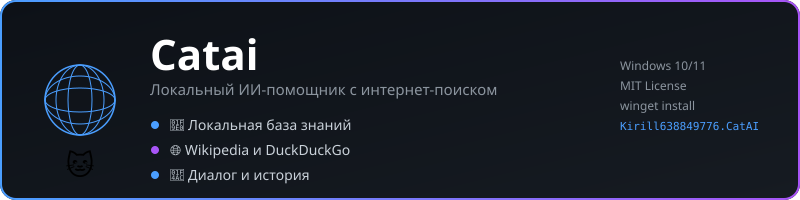

# 🐱 Catai
<p align="center">
  
</p>

**Локальный ИИ-помощник с собственной базой знаний и интернет-поиском.**

[](https://github.com/Kirill638849776/catai/releases)
[](https://winget.run/pkg/Kirill638849776/CatAI)
[](LICENSE)
[](https://github.com/Kirill638849776/catai/releases)

---

## 📖 О проекте

**Catai** — ИИ-помощник, рассчитанный на локальное использование.

Основные возможности:

- 🧠 работа с локальным файлом `knowledge.txt`;
- 🌐 поиск дополнительной информации в интернете через Wikipedia и DuckDuckGo;
- 💬 диалоговый интерфейс и история сообщений;
- 🧹 очистка истории диалога;
- 😼 собственный характер и немного самоиронии.

### 🔐 Приватность

Локальная база знаний хранится на компьютере пользователя. При использовании интернет-поиска приложение обращается к внешним веб-сервисам, поэтому утверждение «полностью локально» не относится к сетевым запросам.

Не размещайте в `knowledge.txt` пароли, токены, персональные данные или другую информацию, которую нельзя передавать во внешние сервисы, если она может попасть в контекст интернет-поиска или запроса.

---

## 📥 Установка

### Через winget (рекомендуется)

Самый быстрый способ — установить Catai через встроенный менеджер пакетов Windows.

Откройте **PowerShell** или **Терминал** и выполните:

```powershell
winget install Kirill638849776.CatAI
